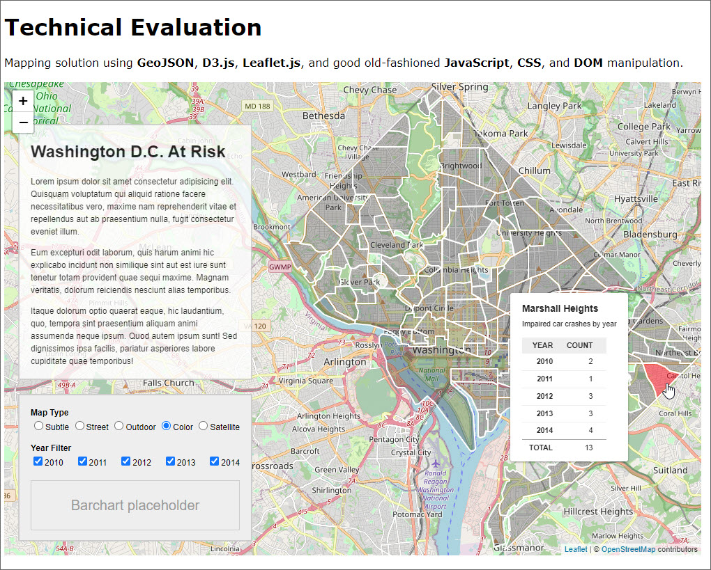

[](https://app.netlify.com/sites/geojson-d3-map/deploys)

**Live Demo:** [https://geojson-d3-map.netlify.app/](https://geojson-d3-map.netlify.app/)

# GeoJSON D3 Map

This was a technical evaluation given as a take-home coding assignment. 


The instructions were as follows:

*Attached is a geojson file. You may reformat/adjust this file as you see fit for the purposes of this project. This file represents impaired car crashes by neighborhood in the Washington, D.C. area over a five year period (2010-2014). Please use the data in this file to create a single page, coherent representation of the data that users can use to understand various angles/depth of the information provided.*

- *Use at least two types of visualization, one of which must be geo-based*
- *Use the D3.js library for at least one of the visualizations*
- *Provide interactivity between visualizations as well as user interactivity points*
- *Provide at least one interaction that allows users to limit/filter/search data*
- *You may use any third-party libraries you see fit in addition to D3*
- *Responsive design / mobile compatibility is optional*

## Project Features

This project was researched over a weekend and completed in a couple days. It employs the following:

- GeoJSON
- D3.js
- Leaflet.js
- JavaScript
- CSS
- DOM manipulation

## Installation

Clone the repository.

```bs
git clone https://github.com/james-priest/geojson-d3-map.git
cd geojson-d3-map
```

Use yarn or npm to install dependencies.

```sh
yarn

# or

npm install
```

## Usage

### Development mode

- Starts a dev server.
- Bundles but does not optimize or minify.
- Launches website at [http://localhost:1234/](http://localhost:1234/).

```sh
yarn start

# or

npm run start
```

### Production mode

- Will build once (No watch mode or hot module replacement).
- Minifies html, js, css, and optimizes image resources.
- Outputs to `dist/`.

```sh
yarn build

# or

npm run build
```

In order to view the production version a local http server needs to be used to launch `dist/index.html` .

Here are two links showing how to spin up a local http server.

- [Simple HTTP Server](http://jasonwatmore.com/post/2016/06/22/nodejs-setup-simple-http-server-local-web-server) - Runs on Node.js.
- [How to run things locally](https://threejs.org/docs/#manual/en/introduction/How-to-run-things-locally) - Instructions for Node.js, Python, & Ruby.

Alternatively, a Visual Studio Code extension can be used to run the site from within the VSCode dev environment.

- [Live Server](https://marketplace.visualstudio.com/items?itemName=ritwickdey.LiveServer) - Launch a development local Server with live reload feature for static & dynamic pages.

## Development Process

Items to answer:

1. Provide a short description indicating thought process.
2. What was done and what wasn't done?
3. What could be improved if time were not a factor?
4. What are some potential issues with the implementation?
5. Provide a rough estimate of time spent on the project.

### Process Description

I had not worked with GeoJSON, D3.js, or Leaflet.js prior to this project.

So, I gave myself the weekend to do the following:

1. Familiarize myself with the GeoJSON specification.
2. Read D3.js docs and examples
3. Read Leaflet.js docs and examples
4. Play with both libraries individually by building small proof-of-concept apps in CodeSandbox and CodePen
5. Get GeoJSON file to render with D3
6. Get GeoJSON file to render with Leaflet then combine D3 polygons and hover states.

Once I had enough separate pieces "working", I considered whether to build in React but opted to keep it simple and just use JavaScript, CSS, and DOM...

I did want the benefits of ES6 modules rather than coding directly in a webpage like most examples show so I opted to use Parcel package manager.

Here are the steps I took:

1. Open VS Code and spin up an instance of Parcel (for quick, no-config, JS packaging)
2. Initialize local git repo for the project
3. Install ESLint & Prettier
4. Create/fine-tune package.json and various rc files
5. Get a GitHub instance going and connect local and remote repos

### Completed Items

Once the dev environment was up and running I built the site in this order:

1. Began with a D3 render of the GeoJSON file - no maps
2. Rendered that same file with D3 but combined Leaflet for raster mapping (vector would have provided a smoother experience but time was limited)
3. Added proper scale (zoom) and translate (position) to map layer
4. Added mouseover/mouseout to D3 neighborhood polygons.
5. Added tooltip to mouseover/mouseout and accessed layer info including GeoJSON properties (impaired driving stats)
6. Displayed these properties in table format within tooltip
7. Created a Legend section
8. Added ability to select different map types through radio buttons with event handlers for the "change" events
9. Hard-coded Year Filter section to limit what data is displayed in tooltip.
10. Added logic to filter out unselected years and aggregate those years that were selected to show an accurate total in the tooltip.

Lastly, I refactored,  and cleaned up both code and UI a bit.

### Additional Items

Some of the things I would have loved to add or include are:

- Mobile-first design approach (in order to target various display viewports for a great User Experience on any device)
- Responsive design using CSS media queries, and dynamic grow/shrink of map based on viewport and resize events for better Usability
- Dynamic D3 bar chart that adjusts and animates the yearly stats for each neighborhood as the mouse moves over each region to provide enhanced visualization of data
- Absolute position tooltip to upper-right corner so the eye doesn't have to chase the popup as the mouse moves over each region. The eye can lock into one are to get the data. Easier on the eyes and better User Experience
- Add Chloropleth view showing darker colors for high frequency/density areas and lighter colors for less frequency/density areas  
- Perhaps some additional toggles if this would help convey the information quicker, cleaner, or easier.

### Potential implementation issues

I deployed this using the automatic build system in Netlify that I set up to trigger on merge of PR requests to the main branch of the GitHub repo.

It can also be configured to publish a "hidden" staged copy for review and approval prior to deploying live.

Some additional issues to pay attention to are

1. "Rights of use" for public map solution (many maps require authorization/subscription)
2. Browser compatibility (mitigated by use of browserlist and PostCSS processing)
3. Maintainability - if more of these sites are to be built then using React for a quicker and more declarative approach might be good
4. Use of Typescript for code-time error checking and to prevent many runtime errors might be preferable

### Time spent

I spent the weekend getting up to speed on all the libraries, standards, and concepts. I then spent the following two days building the solution.

## Screenshots





